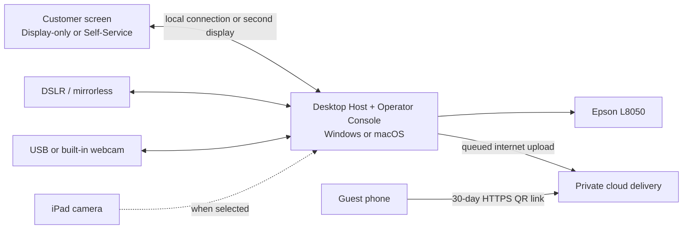

# WanderBooth — Product Plan and Feature Specification

> [!summary] The short version
> WanderBooth will be an offline-first photo booth system for our own business with two staff-selected workflows. In **Attendant-Operated mode**, an operator controls products, layouts, designs, capture, photo replacement, and approval from the laptop while the customer sees a read-only display. In **Self-Service mode**, the customer makes those permitted choices on the touchscreen while staff retain payment, camera, recovery, and administrative controls. The chosen product/layout automatically determines the required photo count. The iPad is the first touchscreen; a future dedicated touchscreen can run the same interface, while attended sessions may use either device or a normal second monitor as the read-only display. A Windows 11 or macOS Sequoia desktop or laptop will act as the **WanderBooth Host**, coordinating a selectable camera source, image processing, local storage, cloud delivery, and Epson printer. Supported source types will include certified DSLR/mirrorless cameras, standard webcams and built-in computer cameras, and the iPad camera. The first pilot will sell both branded digital photos and physical prints, use attendant-confirmed cash payments, and give the customer a private 30-day cloud QR link after the session. For a three-photo strip, that link will offer the branded strip, three branded individual photos, and a short looping slideshow video. A full remote dashboard, electronic payments, and native mobile app can be added later.

## 1. Document purpose

This is the source of truth for what WanderBooth is, what we are building first, and why.

It is written so that a non-developer can understand:

- what the customer will experience;
- what the business owner and booth attendant can control;
- which features are required for the first usable release;
- which features are intentionally postponed;
- how the application will work at a high level;
- how development changes will be documented and versioned; and
- what decisions remain as implementation continues.

When a product decision changes, update this document and record the change in [[WanderBooth - Changelog]].

## 2. Product vision

**WanderBooth makes buying and receiving a professionally branded photo simple, fast, and dependable—even when an event has poor or no internet.**

The product is being built for our own photo business first. It is not initially intended to be a software-as-a-service product for other photo booth operators.

### The problem we are solving

Existing photo booth products contain many useful features, but their printing, connectivity, subscriptions, payment providers, and multi-device setups can introduce unnecessary complexity. We need a focused system that we understand and control ourselves.

Customers should not need to install an application, create an account, or wait for an email. They should finish a photo session, scan a QR code, and save their photo.

The business should be able to keep serving customers during internet interruptions, recover from an application or device restart, and understand exactly what happened when a session fails.

### Product principles

1. **Offline first:** internet loss must not block capture, local saving, or printing, and pending cloud delivery must recover automatically.
2. **QR delivery first:** the simplest delivery method is scanning a cloud-backed QR code after the session.
3. **Reliability before novelty:** a successful capture and delivery matters more than AI effects or 360 video.
4. **Local ownership:** original photos and business data are stored locally first, then synchronized when appropriate.
5. **Shared desktop core:** target Windows 11 and macOS Sequoia, while certifying one exact pilot computer before broad hardware support.
6. **Replaceable camera sources:** camera-specific behavior stays behind a common interface so the operator can choose among supported cameras without changing the rest of the booth workflow.
7. **Explicit control ownership:** every action is assigned to the operator or customer according to the active operation mode; hidden controls are enforced as permissions, not merely removed visually.
8. **Understandable operations:** error messages, logs, and controls must be readable by a booth attendant who is not a developer.
9. **Privacy by default:** customer photos are private, access links are difficult to guess, and files are automatically removed according to a documented retention policy.

## 3. Decisions and assumptions

### Confirmed decisions

- The product name is **WanderBooth**.
- WanderBooth is initially for our own business.
- The application must be offline-first.
- The desktop Host will target **Windows 11** and **macOS Sequoia 15.7.5 or later**.
- Phase 0 starts on a **MacBook Pro (Mac15,6) with an Apple M3 Pro, 18 GB memory, and macOS Sequoia 15.7.5**.
- An **iPad Pro 12.9-inch (6th generation) running iPadOS 18.2** will be the first Self-Service touchscreen and can also be an attended display-only screen or optional camera source.
- A future dedicated touchscreen must be able to replace the iPad without changing the Self-Service workflow.
- Attendant-Operated mode supports either the iPad/future touchscreen in display-only mode or a normal second monitor connected to the Host.
- The iPad uses Safari on the same local network for normal Self-Service touch. Sidecar may be used as an extended display for the read-only Attendant-Operated presentation.
- The first pilot will sell **both branded digital photos and physical prints**.
- The first pilot will accept **cash only**, confirmed by a booth attendant.
- Cash must be collected and confirmed **before capture**.
- WanderBooth will provide **Attendant-Operated** and **Self-Service** operation modes.
- The owner or attendant selects and starts the operation mode before serving customers. Customers cannot change modes.
- In Attendant-Operated mode, staff control product, layout, design/style, capture, photo replacement/retake, and final approval from the operator console. The customer-facing screen is display-only.
- In Self-Service mode, customers can choose only owner-approved products, layouts, and designs and can use configured review/replacement/retake actions from the touchscreen.
- The selected product/layout determines the required photo count automatically; neither the operator nor customer chooses an independent count during a session.
- In Attendant-Operated mode, captured photos are shown on the customer display. The customer may verbally request a replacement, but only the operator performs it.
- Staff retain camera-source selection, cash confirmation, refunds, reprints, recovery, and administrative controls in both modes.
- Because version 1 accepts cash only, Self-Service mode still needs an attendant to confirm payment. Fully unattended operation requires a future electronic-payment flow.
- A customer must be able to retrieve the finished photo through a QR code after the session.
- QR access will expire after **30 days**.
- The QR link must work away from the booth for the full 30 days, using private cloud delivery.
- Guests do not need to join WanderBooth Wi-Fi; they may use mobile data or any internet connection.
- Local customer-photo backups will be kept for **30 days**.
- The customer receives the **final branded photo only**, not the original capture.
- A three-photo strip session will provide three separately downloadable branded photos, the final branded strip, and a looping slideshow video with each photo shown for approximately 1.5 seconds.
- Customers receive up to **two retakes**.
- Initial print formats are **4×6** and **2×6 photo strips**.
- The first implemented product is a **three-photo vertical 2×6 strip**. The 4×6 product follows after the first workflow is proven.
- The first double-strip physical print is **one 4×6 sheet containing two 2×6 strips with six unique shots**, ready to cut into two different three-photo strips.
- Layout and frame are separate choices: the layout controls photo placement/count, while the frame is either a fixed WanderBooth color with an optional built-in decoration or one imported custom design. Fixed-color and custom-frame modes are mutually exclusive.
- The first catalog includes **two product families, five layouts, five frame palettes, and four overlay choices**.
- The Double strip 4×6 layout contains six visible slots and takes six unique captures: Photos 1–3 fill the left strip and Photos 4–6 fill the right strip.
- Initial slot shapes include rectangles, rounded rectangles, and a heart-shaped feature photo.
- The owner or attendant can import event-frame artwork from the Mac operator screen after selecting a layout. New imports use a transparent PNG whose photo openings are prepared before import; the artwork is always layered above the photos. Previously imported flat templates remain readable for backward compatibility, but automatic cutout creation is no longer part of the normal operator flow.
- Imported frames are stored locally, persist across application restarts, are limited to their selected layout, and are not added to the public repository.
- Before serving customers, the owner or attendant can turn imported artwork into an approved reusable template by aligning numbered photo placeholders once and saving the product, layout, frame artwork, artwork transform, every photo-holder transform, every default image crop, rotations, and locks.
- Saved templates appear in a Template Gallery at session selection. Choosing one automatically restores its layout, required photo count, artwork, and every saved placement; real captures fill the numbered placeholders in capture order.
- The Template Gallery also supports a blank custom 4×6 canvas in portrait or landscape orientation. Staff can add between one and eight independently editable photo holders, assign each holder to Capture 1 through Capture 8, and reuse one capture in several holders. For example, holder labels `1, 1, 2, 3` require only three actual photos while rendering Capture 1 twice.
- Custom holder assignments are normalized into one continuous capture sequence, so a template never asks the booth to skip a capture number. Every repeated holder keeps its own position, size, rotation, crop, and lock state even when it displays the same captured photo as another holder.
- Template creation, editing, duplication, and deletion are staff-only. A Self-Service customer may choose an approved saved template but cannot change the saved definition. The post-capture direct editor remains available to staff for session-specific final adjustments.
- The operator can delete a saved template after confirmation without deleting its reusable artwork. Imported artwork can be deleted separately only after no saved templates reference it; deleting it removes WanderBooth's private normalized source and preview without changing the owner's original file.
- During review, the finished composed layout is shown beside uncropped source captures in consistently sized 16:9 cards. Only the owner or attendant can use the direct canvas: click the imported artwork or a photo frame, drag it in place, resize proportionally from a corner, reshape one holder edge from its middle handle, rotate it directly, lock it, or enter Crop image mode to reposition and proportionally scale the capture inside its frame. Reshaping the holder changes the crop window without stretching the photograph. There is no zoom slider. Those adjustments are stored and applied to the final render.
- One tap starts the complete layout-defined sequence of up to eight photos, with a **three-second countdown before each photo**. Built-in layouts currently require three, four, or six captures; a saved custom layout derives its count from its Capture labels.
- The customer preview is mirrored for natural posing, while saved and delivered photos are not mirrored.
- The first pilot will include approximately **5–10 layouts/designs**.
- Available camera hardware: **Canon EOS 60D** and **Fujifilm X-M5**.
- WanderBooth must offer a camera-source selector that is available only to the owner or attendant. Customers cannot change the active camera source.
- Supported source types must include dedicated DSLR/mirrorless cameras, USB/UVC webcams, built-in Windows/Mac laptop cameras, and the iPad camera.
- The camera system must be extensible so additional brands and models can be added through adapters and tested compatibility profiles.
- The starting MacBook camera is implemented as an Experimental standard video-device source. One packaged three-photo session passed at 1920×1080; it is not yet certified for customers or prints.
- The first printer is an **Epson EcoTank L8050**.
- A remote web dashboard is useful but is not required for the first release.
- Product development must be carefully documented and version-controlled.
- Documentation must remain understandable to a non-developer.
- The owner supplied the working Wander Press PH logo set. Phase 0 uses its measured palette: Wander blue, splash lime, pop yellow, signature cream, press orange, and shadow purple. The original 6000×6000 source PNGs remain unchanged and separately documented.
- The public source repository is **[kurge/WanderBooth](https://github.com/kurge/WanderBooth)**.
- The public repository remains under default copyright for now; an open-source license may be selected later.

See [WanderBooth Hardware Baseline](docs/HARDWARE.md) for manufacturer evidence and the test plan, and [Camera Compatibility Matrix](docs/CAMERA_COMPATIBILITY.md) for source-by-source status.

See [Operation Modes](docs/OPERATION_MODES.md) for the detailed permissions and screen behavior of both workflows.

See [Layouts, Frames, and Overlays](docs/TEMPLATES_AND_OVERLAYS.md) for the current catalog, authoring rules, and findings from the supplied sample templates.

### Proposed decisions awaiting confirmation

- The Host will be an installable desktop application and will serve the responsive booth interface to the iPad or future touchscreen over a shared local connection; it can also open a read-only presentation on a directly connected second monitor.
- The **Fujifilm X-M5 is the first dedicated camera to certify** because it is the newer tether-capable option; the Canon EOS 60D remains an owned secondary target.
- The starting MacBook camera is the first real camera adapter. The iPad camera will then prove that the shared interface is not tied to a camera physically attached to the Host.
- Essential administration—products, prices, sessions, settings, and local sales—will be inside a PIN-protected owner area.
- The Host and networked customer device may share venue Wi-Fi or a personal/mobile hotspot. A dedicated router is optional unless field testing shows it is needed for reliability.

### Phase 0 implementation checkpoint

The first working foundation now exists on the `codex/phase-0-foundation` branch:

- React operator and customer surfaces synchronize through a local WebSocket Host.
- Host-side permissions enforce the difference between Attendant-Operated and Self-Service modes.
- The selected layout fixes the session capture count. Classic 2×6 uses three; Double strip 4×6 uses six unique shots; a custom saved template derives one to eight unique captures from its holder labels.
- Cash confirmation is staff-only and occurs before capture; no price appears on screen.
- Session state and command history persist in a local SQLite database.
- A development-only camera simulator exercises capture and two-retake behavior safely.
- Staff can select the simulator or MacBook camera only while the booth is idle. The Mac path includes permission handling, physical device choice, a reduced mirrored preview relayed to the customer screen, and separate full-resolution unmirrored JPEG transfer.
- One action starts every photo required by the selected layout. The Host advances and broadcasts the three-second countdown before each capture so the Mac and customer screen cannot drift apart.
- Retakes use the same synchronized countdown, and staff can cancel an active session safely back to idle.
- The selection menu offers built-in three-photo, four-photo, and six-photo arrangements plus saved portrait or landscape custom templates with one to eight holders and a derived automatic capture count.
- The renderer now reads data-driven canvas, slot, shape, branding-area, frame, and overlay definitions instead of one hard-coded strip.
- Synthetic rendering checks passed for the six-shot 4×6 double strip with film overlay and the four-photo heart layout with heart overlay.
- The operator imports a transparent PNG whose photo openings have already been prepared. The Host validates, normalizes, stores, and registers the frame locally; the old flat-template format remains renderable for previously imported records.
- The staff-only Template Gallery turns imported artwork into reusable, approved session choices. A pre-capture placeholder editor stores product/layout choice plus artwork, holder, crop, rotation, and lock geometry. Custom portrait or landscape templates can contain up to eight holders, and each holder maps independently to a Capture label so the same photo can appear more than once without sharing its placement settings.
- Fixed colored and imported custom frames use separate selection modes. The review screen previews the actual composition, keeps captured and waiting cards the same size without cropping source images, and gives staff a Canva-style direct canvas for moving, proportionally scaling, rotating, and locking artwork, photo frames, and the images inside them. Middle holder handles can change width or height independently to match an opening, but this changes the crop boundary instead of distorting the capture. Imported frames can also be deleted from local storage after confirmation. The final renderer reuses the exact stored values.
- The packaged Host serves the customer interface over the local network and shows the current Safari address in the operator sidebar.
- Local processing produces three branded individual PNGs, a 600×1800-pixel strip at 300 DPI, and a 1.5-second-per-photo MP4 slideshow.
- Unit tests and a repeatable end-to-end smoke session verify the current workflow.
- A packaged Apple-silicon `WanderBooth.app` and verified DMG can be launched without developer commands on the starting Mac.

This checkpoint is not yet a pilot release. Camera reliability certification, Epson printing, cloud upload, QR generation, the 30-day download page, and automatic retention cleanup are still required.

### Why the first release uses a desktop Host and reusable customer client

A normal website running only on an iPad has limited control over desktop printer drivers, tethered cameras, automatic startup, silent printing, USB-device recovery, and local files.

WanderBooth therefore separates the system into two cooperating parts:

1. **WanderBooth Host on Windows or macOS:** coordinates the active camera source, controls the Epson printer, processes photos, stores sessions, uploads deliverables, and serves the local application.
2. **WanderBooth customer client:** runs full-screen on the iPad now and a future touchscreen later, supports display-only or Self-Service presentation, sends permitted actions to the Host, and can capture through the iPad camera when that source is selected.

This provides the touch experience we want without tying the workflow to one screen model or forcing the customer device to control desktop hardware. It also gives us a path to package the same interface as a native application later if needed.

## 4. Users

### Customer

The person taking and buying the photo. They need a short, obvious, touch-friendly process with no account or application installation.

### Booth attendant

The staff member—also called the **operator** in Attendant-Operated mode—who helps customers, controls attended sessions, checks the camera and printer, restarts failed sessions, approves cash transactions, and reprints when authorized.

### Business owner

The person configuring prices and products, reviewing sales, exporting records, changing branding, checking system health, and managing customer-photo retention.

## 5. Core customer journey

The owner or attendant chooses an operation mode while the booth is idle. The selected mode is PIN-protected, clearly visible on the operator console, recorded on every session, and locked until the current session finishes or is safely cancelled.

The first pilot uses an attendant-confirmed cash flow in both modes. Cash is confirmed before capture so there is no dispute about whether the session was purchased. A manager-authorized complimentary session remains available for testing or customer recovery.

### Attendant-Operated mode

The operator controls the complete session from the Host laptop. The customer-facing screen is read-only: it can show instructions, live preview, countdown, captured photos, processing, print status, QR delivery, and thank-you messages, but it has no product, layout, design, retake, or approval controls.

```text
Operator chooses product, compatible layout, and design
     ↓
WanderBooth loads the capture count required by that product/layout
     ↓
Operator explains privacy notice and records customer consent
     ↓
Operator confirms cash received
     ↓
Customer display shows a mirrored live preview
     ↓
Operator starts the automatic layout-defined capture sequence
     ↓
Host shows a synchronized three-second countdown before each photo
     ↓
Operator reviews the photos with the customer
     ↓
Operator alone replaces a selected photo, uses an allowed retake,
changes the layout/design, or approves the final result
     ↓
WanderBooth renders, prints, uploads, and displays the QR code
```

### Self-Service mode

The touchscreen is interactive. The customer controls only the choices that the owner enabled for the selected product. Staff remain responsible for cash approval, camera configuration, exceptions, recovery, refunds, reprints, and administrative settings.

```text
Attract screen
     ↓
Customer chooses an approved saved template or builds from owner-approved choices
     ↓
Customer chooses an allowed layout and design
     ↓
WanderBooth shows the capture count required by that product/layout
     ↓
Customer reads the privacy notice and continues
     ↓
Attendant confirms cash received
     ↓
Mirrored live preview
     ↓
Customer starts one automatic layout-defined capture sequence
     ↓
Host shows a synchronized three-second countdown before each photo
     ↓
Customer reviews, replaces a selected photo, changes style/design,
or uses an allowed retake before final approval
     ↓
Create final branded photo
     ↓
Print, if purchased
     ↓
Upload deliverables and display private cloud QR code
     ↓
Customer saves photo
     ↓
Session clears and returns to attract screen
```

Owner-defined rules determine which products, layouts, designs, and retake/replacement actions appear in Self-Service mode. Each product/layout defines its required capture count, so a customer cannot create an unsupported combination or choose an unrelated number of photos. After final approval or printing, further changes require staff recovery and, if applicable, an audited reprint.

### Session states

The application must always know the current state of a session. This prevents duplicate charges, missing photos, and duplicate prints.

```text
IDLE
  → PRODUCT_SELECTED
  → LAYOUT_SELECTED
  → DESIGN_SELECTED
  → CONSENTED
  → CASH_PENDING
  → CASH_CONFIRMED
  → COUNTDOWN
  → CAPTURING
  → REVIEWING
  → FINAL_APPROVED
  → PROCESSING
  → PRINT_QUEUED (when applicable)
  → UPLOAD_QUEUED
  → UPLOADING
  → READY_TO_DOWNLOAD
  → FULFILLED
  → RESET
```

Every session records its operation mode and the actor responsible for selections, replacements, approval, payment confirmation, and recovery actions. Every state must also have a clear failure path, such as `CASH_CANCELLED`, `CAMERA_FAILED`, `PRINT_FAILED`, `UPLOAD_PENDING`, `REFUND_REQUIRED`, or `RECOVERY_REQUIRED`. An upload outage must not prevent local printing or erase a session. Electronic-payment states will be added only when online payments enter scope.

## 6. Cloud QR photo delivery with offline recovery

This is a defining WanderBooth feature.

### Customer experience

1. WanderBooth finishes processing and safely saves the session locally.
2. For a three-photo vertical strip, WanderBooth creates:
   - three individually downloadable branded photos;
   - the final branded composite strip; and
   - a short H.264 MP4 slideshow that shows each photo for approximately 1.5 seconds and loops in the web page.
3. The Host uploads those deliverables to private cloud storage.
4. Only after the upload is confirmed, the completion screen displays a QR code for a private HTTPS page.
5. The customer scans the code using any internet connection; they do not join WanderBooth Wi-Fi.
6. The mobile page previews the strip, individual photos, and slideshow, with clear download buttons.
7. The link and cloud media expire 30 days after the session. No account or app installation is required.

### Delivery and security requirements

- Each session receives a cryptographically random, unguessable share token.
- Guessing or changing one token must not reveal another session.
- The mobile page must work on current iPhone and Android browsers.
- The page may show only the branded deliverables for that session; raw camera originals are never uploaded or exposed.
- Access must expire automatically 30 days after the session.
- The attendant must be able to revoke or re-display a session link.
- Files remain private in object storage and are served through controlled or short-lived access URLs.
- Cloud cleanup and local 30-day cleanup must be independently logged and retry safely.
- Downloading should not require a name, phone number, email address, or customer account.

### What happens when internet is unavailable

Offline-first does not mean the phone downloads from the booth. It means the paid session can still be captured, processed, saved, and printed safely while cloud delivery waits.

- The Host saves the finished files and delivery manifest locally before attempting an upload.
- A persistent upload queue retries automatically when connectivity returns, including after an application restart.
- A stable share token and URL may be reserved before upload, but the application must label it **Cloud delivery pending** until every required file is confirmed online.
- If a stable pending link is shown, its page must safely display a not-ready message and become available after the upload completes. Otherwise, the attendant re-displays the QR code once the upload succeeds.
- The booth must show a clear connection/upload status before the customer leaves.
- Printing and the next session must not be blocked by a queued upload, subject to local capacity limits.
- The Host needs venue internet, a phone hotspot, or another data connection for guest delivery. A dedicated travel router is not required for the first pilot.

The iPad still needs a local connection to the Host for booth controls. This may use the same venue Wi-Fi or mobile hotspot, but it is separate from the guest's cloud-download path.

## 7. Feature priorities

### P0 — required for the first real pilot

#### Operation modes and customer-facing presentation

- PIN-protected Attendant-Operated/Self-Service mode selector available only while the booth is idle
- Configurable default mode for an event or booth profile
- Active mode displayed clearly on the operator console and recorded on every session
- Mode cannot change during an active session
- Full-screen customer display with WanderBooth branding
- Live preview, countdown, captured-photo review, processing, print status, QR delivery, and thank-you presentation
- One-tap product-defined capture sequence with a Host-controlled three-second countdown before every photo
- Mirrored posing preview with unmirrored saved and delivered files
- No camera-source, cash, reprint, refund, recovery, or administrative controls on the customer-facing screen in either mode
- Product/layout-defined capture count shown clearly before payment and capture
- Menu of compatible 2×6 and 4×6 portrait/landscape layouts
- Mutually exclusive fixed-color and imported-custom frame modes, with compatible built-in decorations available only for fixed colors
- Final composed-layout review beside full-aspect, uncropped source captures
- Staff-only direct canvas for selecting, dragging, proportional corner resizing, one-axis middle-edge holder reshaping, rotating, locking, and resetting custom-frame artwork and each photo frame, plus a non-distorting crop mode for direct manipulation of the image inside it
- Operator-confirmed deletion of saved templates and unreferenced imported artwork; referenced artwork is protected from accidental deletion
- Staff-only Template Gallery for creating, editing, duplicating, and deleting approved reusable templates before customer sessions
- Numbered pre-capture photo placeholders whose saved holder and crop geometry is automatically reused by real captures
- One-tap approved-template selection in both controlled workflows, with detailed template management hidden from customers
- Six-shot Double strip layout with Photos 1–3 on the left and Photos 4–6 on the right of one 4×6 sheet
- Rectangle, rounded-rectangle, and heart-shaped photo slots
- Up to two configured retake or photo-replacement actions
- Cloud QR delivery that works away from the booth for 30 days
- Three separate branded-photo downloads for a three-photo session
- Final composite-strip download
- Looping slideshow preview and MP4 download at approximately 1.5 seconds per photo
- Clear pending-delivery state and automatic upload retry during an outage
- Automatic timeout and safe reset
- English interface; additional languages can follow

#### Attendant-Operated mode

- Operator console on the Host laptop controls product, layout, design/style, consent, capture, review, retake/replacement, and final approval
- Customer-facing screen operates in display-only mode and cannot accept session choices
- Captured-photo review appears on the customer display so the customer can verbally request a change
- Operator can select a captured-photo slot and replace it using an allowed retake
- Operator can change the layout or design before final approval without repeating successful captures when the new combination is compatible
- Every operator choice and override is recorded in the audit trail

#### Self-Service mode

- Large touch-friendly controls on the customer touchscreen
- Customer-selectable product/package with clear price display
- Customer-selectable owner-approved layout and design/theme
- Required capture count is derived from the selected product/layout and displayed as information, not as a separate choice
- Privacy notice and consent action
- Customer-controlled capture, review, allowed photo replacement/retake, style change, and final approval
- Attendant cash-confirmation gate before capture
- Attendant override and recovery controls remain outside the customer interface
- Customer options are filtered so incompatible product, layout, and design combinations cannot be selected

#### Local owner and attendant area

- PIN-protected access
- Select the operation mode and configure the default for each booth/event profile
- Configure the required capture count for each product/layout and which products, layouts, designs, and review actions are available in each mode
- Open the display-only customer screen or the interactive Self-Service screen
- Staff-only camera-source selector with a friendly name, live test preview, and capability/readiness status
- Create, edit, enable, and disable products
- Set local currency and prices
- Assign a layout to each product
- Create, import, enable, and disable branded designs
- Decide which products, layouts, designs, and review actions customers may use in Self-Service mode
- Configure countdown and retake rules
- Configure QR-access expiration
- View upload status and retry a failed cloud delivery
- Browse completed sessions
- Reopen the latest session
- Re-display a session QR code
- Revoke a download link
- Delete a session according to policy
- View basic daily sales and session counts
- Export session and sales records to CSV
- Run camera, storage, network, and QR-delivery tests
- Export a support/diagnostic package without exposing payment secrets

#### Camera and photo processing

- Present all detected and configured camera sources in a staff-only selector
- Support at least one certified dedicated camera, one standard webcam or built-in computer camera, and the iPad camera in the first pilot
- Keep dedicated-camera, webcam, built-in-camera, and iPad-camera behavior behind one common camera-source interface
- Remember settings for each camera source and booth profile
- Show whether a source supports live preview, remote trigger, focus control, flash, orientation, and expected capture resolution
- Lock the selected source for an active paid session; switching during recovery requires an attendant action and an audit entry
- Detect a missing camera before the customer pays
- Reconnect after a temporary camera interruption
- Never silently switch to a different camera after payment
- Save the original photo before processing
- Crop, rotate, and resize without distorting the image
- Apply a branded frame or overlay
- Generate full-resolution and phone-friendly versions
- Generate individually downloadable branded photos
- Generate an H.264 MP4 slideshow for multi-photo sessions
- Generate Epson L8050 layouts for 4×6 prints and 2×6 strips
- Keep photo-slot geometry separate from frame colors and transparent foreground overlays
- Validate imported artwork aspect ratio, transparency mode, file size, type, and declared layout compatibility before use
- Ship with approximately 5–10 selectable initial layouts/designs
- Store every session in a predictable local folder structure

#### Local data and recovery

- SQLite local database
- Unique session and order identifiers
- Persistent state after application restart
- No lost completed photo after a crash
- Automatic startup with Windows or macOS
- Kiosk lock so customers cannot exit into the desktop operating system
- Storage-capacity warning
- Automatic retention cleanup with an audit record
- Daily local backup to a separately configured location

#### Cash payment for the first pilot

- PHP product prices
- Attendant-only **Cash received** confirmation protected by PIN or staff mode
- Record amount due, amount received, and calculated change
- Cancel an unpaid order without creating a session
- Manager-authorized complimentary or recovery session with a required reason
- Manual cash refund marker and notes
- End-of-day cash sales summary
- Prevent one cash confirmation from fulfilling more than one order
- No online payment provider, payment API, or webhook in version 1

#### Printing for the first pilot

- Support the Epson EcoTank L8050 through the operating system's official Epson printer driver
- Render the Double strip product as one 4×6 sheet containing two vertical 2×6 strips with six unique photos
- Test print
- Automatic print after fulfillment
- Persistent print queue
- Print status: queued, printing, completed, failed, cancelled
- Retry failed job
- Staff-authorized reprint
- Duplicate-print protection
- Configurable maximum copies
- Paper/media counter and low-media warning
- Log printer settings used for each job so a failed result can be reproduced

### P1 — important after the core pilot works

- Additional certified camera adapters and compatibility profiles for other brands and models
- Camera-profile import/export and per-camera color/crop calibration
- Multiple branded templates
- Color, black-and-white, and simple beauty filters
- Background replacement
- Multiple print sizes
- Product bundles
- Promotion codes
- QR Ph, GCash, Maya, and card payments through a Philippine payment provider
- Email or SMS receipt
- Staff accounts and roles
- Remote support connection
- Broader cloud backup and synchronization beyond the P0 QR-delivery service
- Owner web dashboard
- Remote product and price updates
- Device heartbeat and alerts
- Sales reporting by booth and location
- Refund initiation from the owner dashboard
- Automatic application updates with rollback
- Multilingual customer interface

### P2 — future opportunities

- iOS or Android booth application
- GIF and boomerang modes
- Video booth
- 360 video
- AI portraits
- Public event galleries
- Customer surveys and marketing consent
- Social sharing
- Multiple businesses or tenants
- Subscription billing for other booth operators
- Template marketplace
- Multi-location inventory management

### Explicit non-goals for version 1

- Claiming automatic compatibility with every camera and printer; new devices require an adapter or a successful compatibility test
- Building native iOS or Android booth applications; the iPad uses a web client
- Certifying every Windows and Mac computer even though the shared Host is designed for both operating systems
- Building the remote dashboard before the local booth works reliably
- AI photo generation
- Public social galleries
- Selling WanderBooth to other companies
- Collecting marketing data that is not necessary to fulfill the customer's order

## 8. Application screens

### Self-Service customer screens

1. Attract/welcome
2. Product selection
3. Layout selection
4. Design/style selection and automatic required-photo summary
5. Privacy notice
6. Waiting for attendant cash confirmation
7. Get ready/live preview
8. Countdown
9. Capture confirmation
10. Review, replace photo, change style, or retake
11. Final approval
12. Processing
13. Print status
14. Upload status and QR download
15. Thank you/reset

### Attendant-Operated customer display

1. Welcome/waiting
2. Selected-product summary, when enabled
3. Get ready/live preview
4. Countdown and capture feedback
5. Read-only captured-photo review
6. Waiting for operator decision
7. Processing
8. Print status
9. Upload status and QR download
10. Thank you/reset

This display has no interactive product, layout, design, retake, replacement, approval, or administrative controls.

### Attendant screens

1. Status overview and active operation mode
2. Start or switch mode while the booth is idle
3. Attendant-Operated session controller
4. Product, layout, and design selection with automatic required-photo summary
5. Capture, review, photo replacement/retake, style change, and final approval
6. Camera-source selection and test
7. Cash approval
8. Printer test and queue
9. Latest sessions
10. Reprint and re-display QR
11. Error recovery
12. End-of-day summary

### Owner screens

1. Products and prices
2. Layouts and branding
3. Operation-mode and customer-flow settings
4. Sessions and orders
5. Sales summary and CSV export
6. Storage and retention
7. Camera sources, compatibility status, and test preview
8. Device and network configuration
9. Diagnostics and logs

## 9. Recommended first-release architecture

This architecture is a proposal, not a final commitment. Hardware decisions may change it.



The Host remains the source of truth for the session regardless of which camera is selected. A desktop-connected source sends its capture directly to the Host; an iPad-camera capture crosses the local connection and is saved by the Host before processing continues. Only approved branded deliverables are uploaded. The guest phone talks to the cloud—not to the booth computer.

### WanderBooth Host on Windows and macOS

- **Shared interface:** React and TypeScript
- **Desktop shell and hardware host:** Electron
- **Local application service:** Node.js inside the Electron main process
- **Local database:** SQLite
- **Photo processing:** Sharp, with a controlled template renderer
- **QR generation:** a maintained QR-code library
- **Local web server:** a small HTTP server for networked customer screens, bound only to the booth's trusted local connection
- **Live communication:** WebSocket connection between the Host and the active networked customer screen
- **Operation-mode coordinator:** records Attendant-Operated or Self-Service mode, enforces actor permissions, and routes session actions to the correct screen
- **Operator console:** staff controls for attended sessions, cash approval, camera setup, recovery, and fulfillment
- **Camera-source layer:** one shared contract with adapters for vendor-controlled cameras, webcams/built-in cameras, watched-folder workflows, and the iPad client
- **Cloud delivery client:** persistent upload queue, retry logic, and delivery-status tracking
- **Print adapter:** operating-system-specific print integration configured for the Epson L8050
- **Packaging:** Windows installer and notarized macOS application; automatic update support follows the pilot

The Host can also display owner and diagnostic screens directly on the desktop computer. Hardware code must sit behind adapters because camera discovery, permissions, capabilities, printing, startup, and file locations differ between devices and operating systems.

### Operation-mode enforcement

Operation mode is a server-side session policy, not only a visual layout:

- staff authenticate to the operator console with a PIN or staff session;
- customer commands are accepted only when Self-Service mode allows that action;
- Attendant-Operated customer displays receive session state but cannot submit selection, retake, replacement, style, or approval commands;
- switching modes is allowed only while the booth is idle or after an explicitly audited cancellation/recovery;
- every session stores its mode, and every important action stores whether the actor was the customer, attendant, or owner; and
- both displays subscribe to the same persisted session state so they cannot disagree about payment, capture, approval, printing, or delivery.

### Camera-source contract

Every camera adapter must present the same small set of operations to the rest of WanderBooth:

- discover available sources and report a stable friendly name;
- report capabilities and permission/readiness state;
- open and close a preview;
- capture one still image and return it to the Host;
- report progress, errors, disconnects, and recovery options; and
- expose only validated settings appropriate to that source.

The first adapter families are:

1. **Dedicated-camera adapter:** brand/model-specific SDK, tether integration, or a documented watched-folder bridge for cameras such as the Fujifilm X-M5 and Canon EOS 60D.
2. **Standard video-device adapter:** USB/UVC webcams and built-in Windows/Mac cameras using operating-system media APIs.
3. **iPad-camera adapter:** preview and capture run in WanderBooth Touch, then the original capture is transferred to the Host over the local connection before the session advances.

Compatibility is explicit rather than implied. The owner screen will label a source **Planned**, **Certified**, **Experimental**, or **Unavailable**. Detecting a camera does not automatically mean that remote trigger, focus, flash, or full-resolution still capture is supported.

### Customer display and WanderBooth Touch

- In Attendant-Operated mode, the customer presentation may run as a read-only window on a second monitor or in a browser on the iPad or future touchscreen.
- In Self-Service mode, the Host serves the same responsive interactive interface to the iPad now and a future dedicated touchscreen later.
- The iPad opens the interface in Safari or as an installed Progressive Web App, and Guided Access keeps the customer inside WanderBooth. A future touchscreen may use its equivalent kiosk browser or packaged client.
- In Self-Service mode, customer taps send permitted commands to the Host; in Attendant-Operated mode, equivalent commands come only from the operator console. The Host coordinates capture and always controls processing, storage, printing, and delivery. When the iPad camera is selected, the Touch client performs the physical capture and transfers it to the Host.
- No App Store release is required for the first pilot.

### Why Electron plus a local web client is proposed

- It uses web development skills while producing an installable desktop application.
- It supports desktop automatic startup and access to local hardware.
- It supports one shared codebase for Windows and macOS while allowing OS-specific hardware adapters.
- It can access local files and SQLite.
- It provides more printing control than a normal browser.
- It lets the iPad or future touchscreen act as the customer controller without installing desktop printer or vendor-camera drivers; the iPad can also be an optional camera source.
- A large ecosystem makes the initial application easier to maintain than a custom native application.

The trade-off is a larger installation size and higher memory usage. For a dedicated booth laptop or PC, that is acceptable if reliability tests pass.

### Minimal P0 cloud delivery service

The full management dashboard remains deferred, but remote 30-day QR access requires a deliberately small cloud service in P0:

- an authenticated upload API used only by registered booth Hosts;
- private S3-compatible object storage for branded deliverables;
- a small database recording share-token hash, session metadata, upload state, and expiry;
- a public, mobile-friendly download page addressed by an unguessable token;
- scheduled deletion after 30 days, with safe retries and audit records; and
- rate limiting, basic monitoring, and a way for an attendant to revoke access.

The cloud service must never become a dependency for capture, local saving, processing, or printing. A connectivity outage delays only remote delivery.

### Later cloud components

- Owner web dashboard built with React/Next.js
- PostgreSQL-based business reporting and synchronization
- Device heartbeat, remote settings, and support tools
- Broader cloud backup beyond customer delivery files

Architecture decisions are recorded in [docs/decisions](docs/decisions/).

## 10. Conceptual data model

These are the main records the application must understand.

| Record | Plain-language meaning |
|---|---|
| Product | Something a customer can buy, including its allowed layouts, designs, print quantity, price, and mode availability |
| Layout | The arrangement and size of captures and branding; it defines the required photo/capture count for that product combination |
| Session | One customer's complete booth interaction, including its fixed operation mode |
| Capture | An original photo taken during a session |
| Deliverable | The final branded image, strip, print file, or phone-download image |
| Order | The selected product, price, payment state, and fulfillment state |
| Payment | An attendant-confirmed cash payment in version 1; later, a verified electronic payment attempt |
| Print job | A request to send a particular deliverable to a printer |
| Share token | The private random key used in the QR download link |
| Upload job | A persistent request to copy a session's approved deliverables to the cloud, with retry and status information |
| Camera source | A detected or configured device capable of producing a capture, such as a Fujifilm camera, webcam, built-in camera, or iPad |
| Camera profile | The saved adapter, crop, orientation, color, capability, and device settings for one camera source |
| Operation mode | The staff-selected control policy for a session: Attendant-Operated or Self-Service |
| Action actor | Whether an important action was performed by the customer, attendant, owner, or system |
| Design | The branded frame, colors, graphics, and text applied to a layout |
| Device | The booth computer and its configuration |
| Audit event | A timestamped record of an important action or change |

## 11. Privacy and security requirements

- Explain before capture why the photo is being collected and how it will be delivered.
- Collect only data needed to complete the session and payment.
- Do not make one customer's photo visible in another customer's gallery.
- Keep download tokens unguessable.
- Keep uploaded media private, expose only approved branded deliverables, and remove cloud media after 30 days.
- Store future payment-provider secrets outside the user interface and logs.
- Never store full card information when electronic payments are added.
- Record consent, deletion, reprint, refund, and administrative actions.
- Define separate retention periods for QR access, local recovery, and financial records.
- Provide a way to delete a customer's photo when legally and operationally permitted.
- Obtain separate consent before future marketing or public-gallery use.
- Treat children's photos and AI transformations as later policy decisions requiring additional care.

## 12. Reliability requirements

Before WanderBooth accepts paying customers, it must demonstrate:

- 300 consecutive test sessions without losing a completed photo;
- successful restart and recovery during every major session state;
- no duplicate fulfillment from repeated taps or staff actions;
- at least 99% successful print completion when printing is included;
- a median capture-to-delivery time below 45 seconds;
- a visible, understandable recovery instruction for every expected failure;
- complete end-to-end tests for both Attendant-Operated and Self-Service modes;
- rejection of customer-issued selection, replacement, style, approval, and mode-change commands during Attendant-Operated sessions;
- synchronized session state across the operator console and customer screen after disconnect and restart;
- successful QR downloads on current iPhone and Android devices;
- successful cloud upload and QR download over venue internet and mobile data;
- successful capture, processing, saving, and printing with internet disconnected, followed by automatic upload recovery; and
- correct automatic deletion after the configured retention period.

## 13. Development roadmap

### Phase 0 — decisions and end-to-end feasibility experiment

**Goal:** remove the riskiest unknowns before building the full interface.

Tasks:

- Confirm initial products and PHP prices when the business is ready.
- Use the iPad as the first Self-Service touchscreen, test both iPad and second-monitor display-only attended presentations, and keep the customer client responsive for a future dedicated touchscreen.
- Use the confirmed MacBook Pro and record storage requirements as real session files are measured.
- Test the Fujifilm X-M5 as the recommended first dedicated camera: tethering, live view, trigger control, and transfer speed. Test the Canon EOS 60D next or use it as a fallback if the X-M5 path fails.
- Define the shared camera-source contract and implement three feasibility adapters: dedicated camera, standard webcam/built-in camera, and iPad camera.
- Test Epson L8050 print sizes, margins, speed, quality, paper handling, and failure recovery.
- Test the confirmed iPad Pro 12.9-inch (6th generation) on iPadOS 18.2.
- Test Host-to-iPad control over the expected venue Wi-Fi or mobile-hotspot setup.
- Prototype camera selection, readiness checks, preview, capture, and source switching before a session starts.
- Prototype operation-mode selection, the laptop operator console, the read-only customer display, and the interactive Self-Service touch flow.
- Refine the working prototype for layout-defined individual branded photos, a composite strip/card, and an MP4 slideshow.
- Render a print-ready 4×6 sheet containing two different three-photo 2×6 strips from six unique captures.
- Use the working data-driven catalog to test built-in three-, four-, and six-photo layouts plus custom one-to-eight-capture templates, frame palettes, overlays, and shaped slots.
- Test the implemented staff-only transparent-artwork and flat-template importer with the final production designs.
- Use the implemented Template Gallery to prepare, save, and reuse the first production layouts before the first busy event test.
- Test the working browser-to-Host control connection from the physical iPad.
- Prototype queued upload to private cloud storage and a 30-day mobile download page.
- Verify that capture and printing continue with internet disconnected and that the upload completes after reconnection.

Exit condition: both operation modes complete the same persisted layout-defined workflow; Attendant-Operated choices work only from the operator console; Self-Service choices work from the touchscreen; all three camera adapter families can provide the captures; a phone downloads the results from a private cloud QR page; and an interrupted upload resumes safely after reconnection.

### Phase 1 — offline photo-session prototype

Tasks:

- Create the Host application and iPad web client.
- Add the operation-mode coordinator, operator console, display-only presentation, and Self-Service presentation.
- Add iPad Guided Access instructions and Host automatic startup.
- Add attract, preview, countdown, capture, two-retake, review, processing, upload-status, and QR screens.
- Add staff-only camera selection, per-source readiness tests, and safe recovery when a source disconnects.
- Add action permissions and actor audit records for product, layout, design, capture, replacement/retake, and final approval.
- Add session folders and SQLite records.
- Add restart recovery.
- Add a simple local owner area.

Exit condition: a complete unpaid test session works repeatedly, local capture remains usable without internet, and queued cloud delivery recovers after reconnection.

### Phase 2 — products and business workflow

Tasks:

- Add products and local pricing.
- Prepare and approve the first 5–10 production templates and branding assets in the working Template Gallery.
- Add session history and CSV export.
- Add retention and cleanup.
- Add staff PIN and audit records.

Exit condition: the business can configure and operate one booth without editing code.

### Phase 3 — payment and printing

This phase implements the confirmed cash and Epson printing workflow. Electronic payments remain deferred.

Tasks:

- Add attendant-confirmed cash approval and change calculation.
- Add fulfillment and refund states.
- Integrate the Epson L8050 through the selected pilot operating system's driver.
- Add print queue, retry, and reprint protection.

Exit condition: one cash-confirmed order reliably produces exactly one purchased digital deliverable and the correct number of prints.

### Phase 4 — hardening and controlled pilot

Tasks:

- Run power-loss, network-loss, camera-loss, and printer-loss tests.
- Run identical acceptance scenarios in Attendant-Operated and Self-Service modes, including forbidden customer actions in attended sessions.
- Publish a tested camera-compatibility matrix and label every source Certified, Experimental, or Unavailable.
- Complete 300-session reliability test.
- Package the selected pilot operating system first, then validate the other desktop target.
- Prepare operator setup and troubleshooting guides.
- Run a staff-only pilot, then a limited customer pilot.
- Review metrics and incidents after each pilot.

### Phase 5 — dashboard and expansion

- Build the full remote web dashboard only after the booth is stable.
- Expand the existing minimal delivery service with remote configuration, broader cloud backup, support tools, and reporting.
- Evaluate a mobile booth app after real usage clarifies the need.

## 14. Version-control and documentation process

### Repository setup

The public repository is **[github.com/kurge/WanderBooth](https://github.com/kurge/WanderBooth)**. This project folder is initialized as its own nested Git repository so Git does not use the unrelated repository currently rooted at `/Users/kurgegarcia`.

Because the repository is public, it must never contain real customer photos, session databases, cash records, credentials, API keys, local backups, or diagnostic exports. Synthetic fixtures may be committed only when their ownership and redistribution rights are clear.

Suggested repository structure:

```text
wanderbooth/
├── README.md
├── WanderBooth - Changelog.md
├── WanderBooth - Product Plan and Feature Specification.md
├── docs/
│   ├── HARDWARE.md
│   ├── CAMERA_COMPATIBILITY.md
│   ├── OPERATION_MODES.md
│   ├── ARCHITECTURE.md
│   ├── RUNBOOK.md
│   └── decisions/
├── apps/
│   └── desktop/
├── packages/
│   └── shared/
└── tests/
```

### Release versions

Use semantic versioning:

- `0.1.0` — early prototype
- `0.2.0` — new prototype capability
- `0.2.1` — bug fix without a new capability
- `1.0.0` — first production release approved for paying customers

### Change workflow

1. Every task begins with a written goal and acceptance criteria.
2. Work happens on a small branch, using `codex/` for Codex-created branches.
3. Commits describe one logical change.
4. Automated tests run before changes are merged.
5. Material product or architecture decisions receive a short decision record.
6. User-visible changes are added to `CHANGELOG.md`.
7. Releases are tagged in GitHub.
8. No credentials, customer photos, local databases, or production payment data are committed.
9. Changes pushed directly to `main` are limited to initial documentation/bootstrap work; application code uses reviewed branches.

Suggested commit language:

```text
feat: add cloud session download page
fix: prevent duplicate print fulfillment
docs: record first-camera decision
test: cover session recovery after restart
```

### Documentation that must exist before production

- Product plan
- Architecture overview
- Hardware setup guide
- Booth-operator guide
- Troubleshooting runbook
- Privacy and retention policy
- Payment/refund procedure
- Release checklist
- Incident log
- Changelog

## 15. Major risks

| Risk | Why it matters | Early response |
|---|---|---|
| Cloud upload or mobile data fails | Customer cannot immediately open the 30-day QR page | Preserve all deliverables locally, queue retries, show an honest pending state, and re-display the QR after recovery |
| Camera disconnects | Cash-confirmed customer cannot take a photo | Detect readiness before cash confirmation and implement reconnect/recovery |
| Camera cannot be controlled from our app | The selected camera may tether only through manufacturer software | Run a time-boxed Fujifilm X-M5 integration spike and keep the Canon 60D or a watched-folder workflow as fallback |
| A detected camera lacks required capabilities | Preview may work while full-resolution capture, flash, focus, or remote trigger does not | Use capability reporting, compatibility labels, and source-specific acceptance tests before marking a device Certified |
| iPad or webcam quality is too low for a paid print | A technically successful capture may produce an unacceptable product | Show expected resolution, calibrate crop/orientation, warn the attendant, and certify sources separately for digital-only versus print products |
| iPad loses its Host connection | Customer interface cannot trigger or observe the session | Test the actual shared network/hotspot, show connection status, reconnect automatically, and recover the session safely |
| Printer fails after cash confirmation | Customer paid but receives nothing | Persistent print queue, staff recovery, reprint protection, refund state |
| Power loss | Session or order may be lost | Persist every state transition in SQLite and save files before moving forward |
| Repeated tap or staff action | Duplicate order or print | Idempotent commands and unique fulfillment constraints |
| Wrong operation mode is active | Customers may see controls they should not have, or staff may be unable to run the session | Show the active mode prominently, PIN-protect changes, lock it during sessions, and record it on every session |
| Customer bypasses display-only restrictions | A customer could change choices or approve a result in Attendant-Operated mode | Enforce permissions on the Host, reject unauthorized commands, and do not rely only on hiding buttons |
| Operator and customer screens disagree | The wrong photo, design, or payment state could be shown | Use one persisted session state, ordered events, reconnection synchronization, and visible stale/offline status |
| Storage fills | New sessions fail or old files remain indefinitely | Capacity warnings, retention cleanup, and backups |
| Supporting Windows and macOS too early | OS-specific camera and printing work can double the first milestone | Keep shared application code, isolate adapters, and certify one exact pilot computer before validating the second OS |
| Supporting too much hardware | Development becomes unpredictable | Build a replaceable adapter system, but certify camera sources and exact configurations incrementally |
| Privacy mistake | Customer trust and legal exposure | Private tokens, clear notice, minimum collection, and automatic deletion |

## 16. Remaining Phase 0 questions for the owner

The repository and product baseline now exist. Most workflow decisions are confirmed. These remaining answers can be resolved while the feasibility prototype begins; the first three hardware answers are needed before direct camera integration starts.

### Hardware

1. Will the Host and iPad normally share venue Wi-Fi, a dedicated mobile hotspot, or a phone hotspot?

### Products and design

2. What PHP price will the first double-strip print use? Price may remain blank until the business decides it.
3. Who will design the final 5–10 production layouts using the supplied Wander Press PH identity?

### Pilot timing

4. Replace “a few months from now” with a target month or event once it is known.

## 17. Plain-language glossary

| Term | Meaning |
|---|---|
| Desktop application | A program installed on the computer, like Spotify or Photoshop, rather than a website opened in a browser |
| Host | The Windows or macOS part of WanderBooth that controls hardware, storage, processing, printing, cloud uploads, and the local iPad service |
| Attendant-Operated mode | Staff controls the session from the operator console while the customer-facing screen only displays progress and results |
| Self-Service mode | The customer controls owner-approved session choices on the touchscreen while staff retain payment and administrative controls |
| Unattended operation | A booth that can complete payment and fulfillment without staff; this is not part of the cash-only first release |
| Operator console | The staff-only interface on the Host laptop used to control attended sessions and recover either mode |
| Display-only screen | A customer-facing screen that shows session information but cannot submit choices or changes |
| Camera source | The currently selected device that supplies photos, such as a dedicated camera, webcam, built-in computer camera, or the iPad camera |
| Camera adapter | A small integration layer that translates one kind of camera's controls and results into WanderBooth's shared camera-source interface |
| Certified camera | A camera/source configuration that passed WanderBooth's preview, capture, quality, recovery, and reliability tests |
| Customer client | The responsive display-only or interactive interface loaded on the iPad now and a future touchscreen later |
| Offline first | Core work succeeds locally even when internet is unavailable |
| Local network | The shared Wi-Fi or hotspot connection used by a networked customer screen to communicate with the Host; guest phones do not need to join it |
| Local server | A small part of WanderBooth that serves the customer interface and receives permitted booth commands |
| Cloud delivery service | The small online system that privately stores approved deliverables and serves the 30-day QR page |
| Upload queue | A durable list of cloud uploads that still need to run or retry |
| SQLite | A small database stored as a file on the booth computer |
| Webhook | A secure message from a payment provider telling WanderBooth that a payment succeeded or failed |
| Idempotency | Protection that makes repeated messages produce only one order, download, or print |
| Kiosk mode | A locked full-screen mode that prevents customers from opening other computer applications |
| Expiring link | A download address that stops working after a defined time |
| Semantic versioning | A consistent numbering system for releases, such as `0.2.1` |
| Acceptance criteria | Specific checks that prove a task works as intended |

## 18. Document change history

| Version | Date | Change |
|---|---|---|
| 1.5.0 | 2026-10-02 | Added a staff-only reusable Template Gallery: align numbered placeholders before service, save or duplicate the full frame/holder/crop setup, let sessions apply approved templates in one tap, and protect referenced artwork from deletion. |
| 1.4.1 | 2026-10-02 | Made corner resizing proportional, changed middle edge handles into one-axis crop-frame controls, prevented image stretching in preview and export, and added schema-version-9 photo-transform normalization. |
| 1.4.0 | 2026-10-02 | Changed Double strip 4×6 to six unique captures, replaced slider scaling with direct edge/corner resizing and rotation, added persistent object locks and imported-template deletion, and normalized captured/waiting review-card sizes. |
| 1.3.0 | 2026-10-02 | Replaced the target-button alignment panel with a Canva-style direct composition canvas: click/tap to select, drag to move, resize from corner handles, and enter Crop image mode to position a capture inside its frame. |
| 1.2.0 | 2026-10-02 | Split each custom-frame photo into an independently movable/scalable holder and image crop, kept transparent artwork above all photos, made transparent PNG the standard import path, and removed stretched whitespace from captured-photo previews. |
| 1.1.0 | 2026-10-02 | Separated fixed-color and imported-custom frame modes, added the final composition preview, removed source-review cropping, and added persistent staff-only drag/zoom alignment for the custom frame and each unique photo. |
| 1.0.0 | 2026-10-02 | Added the staff-only local event-frame importer for PNG, JPEG, and WebP artwork, including automatic photo cutouts for flattened templates, persistent layout compatibility, validation, previews, and final rendering above captured photos. |
| 0.9.0 | 2026-10-02 | Replaced the fixed template assumption with a product-compatible catalog of five layouts, five frame palettes, and four optional overlays, including repeated double strips, four-photo portrait/landscape cards, and a heart-shaped slot. |
| 0.8.0 | 2026-10-02 | Added the synchronized one-tap three-photo sequence, three-second countdowns, relayed mirrored customer preview, unmirrored saved captures, staff cancellation, and the first 4×6 double-strip print decision. |
| 0.7.0 | 2026-10-02 | Implemented the Experimental MacBook camera source, verified a packaged three-photo session, served the customer screen from the packaged Host, and documented Safari versus Sidecar iPad setup. |
| 0.6.1 | 2026-10-02 | Imported the owner-supplied Wander Press PH source artwork, documented exact brand tokens, replaced placeholder colors, and added a verified double-clickable Mac application and DMG build. |
| 0.6.0 | 2026-10-02 | Confirmed the starting MacBook Host, X-M5 and built-in-camera order, first three-photo 2×6 product, iPad screen, no on-screen price, placeholder brand direction, and the first working local prototype checkpoint. |
| 0.5.1 | 2026-10-02 | Confirmed iPad-first and future-touchscreen display support, second-monitor attended presentation, read-only customer photo review, operator-controlled replacement, and product/layout-derived capture counts. |
| 0.5.0 | 2026-10-02 | Added Attendant-Operated and Self-Service modes with distinct control ownership, screen behavior, permissions, photo replacement/style rules, and operator/customer workflows. |
| 0.4.1 | 2026-10-02 | Confirmed that camera-source selection is restricted to the owner or attendant and is not shown in the customer-facing flow. |
| 0.4.0 | 2026-10-02 | Replaced the single-camera assumption with an operator-selectable camera-source system covering dedicated cameras, webcams, built-in computer cameras, and the iPad camera, with adapters and explicit compatibility levels. |
| 0.3.0 | 2026-10-02 | Confirmed Windows 11 and macOS Sequoia targets, iPad hardware, cash-before-capture, two retakes, 4×6 and 2×6 formats, 5–10 designs, and cloud QR delivery containing individual branded photos, a composite, and a looping slideshow. |
| 0.2.0 | 2026-10-02 | Confirmed digital and print products, cash-only pilot, iPad touchscreen, owned Canon/Fujifilm/Epson hardware, 30-day retention, branded-only delivery, public GitHub repository, and Host-plus-iPad architecture. |
| 0.1.0 | 2026-10-01 | Initial product plan covering offline-first operation, QR photo delivery, first-release features, proposed architecture, roadmap, version control, risks, and blocking questions. |
