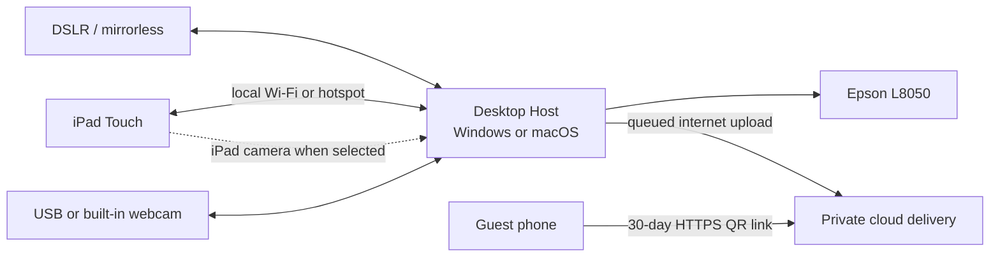

# WanderBooth — Product Plan and Feature Specification

> [!summary] The short version
> WanderBooth will be an offline-first photo booth system for our own business. A Windows 11 or macOS Sequoia desktop or laptop will act as the **WanderBooth Host**, coordinating a selectable camera source, image processing, local storage, cloud delivery, and Epson printer. Supported source types will include certified DSLR/mirrorless cameras, standard webcams and built-in computer cameras, and the iPad camera. An iPad Pro will provide the customer-facing touchscreen and may also act as the selected camera. The first pilot will sell both branded digital photos and physical prints, use attendant-confirmed cash payments, and give the customer a private 30-day cloud QR link after the session. For a three-photo strip, that link will offer the branded strip, three branded individual photos, and a short looping slideshow video. Products, prices, designs, sessions, and sales will initially be managed locally. A full remote dashboard, electronic payments, and native mobile app can be added later.

## 1. Document purpose

This is the source of truth for what WanderBooth is, what we are building first, and why.

It is written so that a non-developer can understand:

- what the customer will experience;
- what the business owner and booth attendant can control;
- which features are required for the first usable release;
- which features are intentionally postponed;
- how the application will work at a high level;
- how development changes will be documented and versioned; and
- what decisions must be made before coding begins.

When a product decision changes, update this document and record the change in [[WanderBooth - Changelog]].

## 2. Product vision

**WanderBooth makes buying and receiving a professionally branded photo simple, fast, and dependable—even when an event has poor or no internet.**

The product is being built for our own photo business first. It is not initially intended to be a software-as-a-service product for other photo booth operators.

### The problem we are solving

Existing photo booth products contain many useful features, but their printing, connectivity, subscriptions, payment providers, and multi-device setups can introduce unnecessary complexity. We need a focused system that we understand and control ourselves.

Customers should not need to install an application, create an account, or wait for an email. They should finish a photo session, scan a QR code, and save their photo.

The business should be able to keep serving customers during internet interruptions, recover from an application or device restart, and understand exactly what happened when a session fails.

### Product principles

1. **Offline first:** internet loss must not block capture, local saving, or printing, and pending cloud delivery must recover automatically.
2. **QR delivery first:** the simplest delivery method is scanning a cloud-backed QR code after the session.
3. **Reliability before novelty:** a successful capture and delivery matters more than AI effects or 360 video.
4. **Local ownership:** original photos and business data are stored locally first, then synchronized when appropriate.
5. **Shared desktop core:** target Windows 11 and macOS Sequoia, while certifying one exact pilot computer before broad hardware support.
6. **Replaceable camera sources:** camera-specific behavior stays behind a common interface so the operator can choose among supported cameras without changing the rest of the booth workflow.
7. **Understandable operations:** error messages, logs, and controls must be readable by a booth attendant who is not a developer.
8. **Privacy by default:** customer photos are private, access links are difficult to guess, and files are automatically removed according to a documented retention policy.

## 3. Decisions and assumptions

### Confirmed decisions

- The product name is **WanderBooth**.
- WanderBooth is initially for our own business.
- The application must be offline-first.
- The desktop Host will target **Windows 11** and **macOS Sequoia 15.7.5 or later**.
- An **iPad Pro 12.9-inch (6th generation) running iPadOS 18.2** will be the customer-facing touchscreen for the first booth.
- The first pilot will sell **both branded digital photos and physical prints**.
- The first pilot will accept **cash only**, confirmed by a booth attendant.
- Cash must be collected and confirmed **before capture**.
- WanderBooth should support both attended and eventually unattended operation, but the cash-only pilot requires an attendant.
- Customers can choose their product, print layout, and design; the attendant can assist or make the selection for them.
- A customer must be able to retrieve the finished photo through a QR code after the session.
- QR access will expire after **30 days**.
- The QR link must work away from the booth for the full 30 days, using private cloud delivery.
- Guests do not need to join WanderBooth Wi-Fi; they may use mobile data or any internet connection.
- Local customer-photo backups will be kept for **30 days**.
- The customer receives the **final branded photo only**, not the original capture.
- A three-photo strip session will provide three separately downloadable branded photos, the final branded strip, and a looping slideshow video with each photo shown for approximately 1.5 seconds.
- Customers receive up to **two retakes**.
- Initial print formats are **4×6** and **2×6 photo strips**.
- The first pilot will include approximately **5–10 layouts/designs**.
- Available camera hardware: **Canon EOS 60D** and **Fujifilm X-M5**.
- WanderBooth must offer a camera-source selector that is available only to the owner or attendant. Customers cannot change the active camera source.
- Supported source types must include dedicated DSLR/mirrorless cameras, USB/UVC webcams, built-in Windows/Mac laptop cameras, and the iPad camera.
- The camera system must be extensible so additional brands and models can be added through adapters and tested compatibility profiles.
- The first printer is an **Epson EcoTank L8050**.
- A remote web dashboard is useful but is not required for the first release.
- Product development must be carefully documented and version-controlled.
- Documentation must remain understandable to a non-developer.
- The public source repository is **[kurge/WanderBooth](https://github.com/kurge/WanderBooth)**.
- The public repository remains under default copyright for now; an open-source license may be selected later.

See [WanderBooth Hardware Baseline](docs/HARDWARE.md) for manufacturer evidence and the test plan, and [Camera Compatibility Matrix](docs/CAMERA_COMPATIBILITY.md) for source-by-source status.

### Proposed decisions awaiting confirmation

- The exact first-pilot Host computer and its operating system, processor, memory, and storage still need to be selected.
- The Host will be an installable desktop application and will serve the touch-friendly booth interface to the iPad over a shared local connection.
- The **Fujifilm X-M5 is the recommended first dedicated camera to certify** because it is the newer tether-capable option; the Canon EOS 60D remains an owned secondary target.
- A generic webcam or built-in computer camera and the iPad camera will be used to prove that the shared camera-source interface is not tied to one camera brand.
- Essential administration—products, prices, sessions, settings, and local sales—will be inside a PIN-protected owner area.
- The Host and iPad may share venue Wi-Fi or a personal/mobile hotspot. A dedicated router is optional unless field testing shows it is needed for reliability.

### Why the first release uses a desktop Host and iPad client

A normal website running only on an iPad has limited control over desktop printer drivers, tethered cameras, automatic startup, silent printing, USB-device recovery, and local files.

WanderBooth therefore separates the system into two cooperating parts:

1. **WanderBooth Host on Windows or macOS:** coordinates the active camera source, controls the Epson printer, processes photos, stores sessions, uploads deliverables, and serves the local application.
2. **WanderBooth Touch on iPad:** shows the customer interface in a full-screen local web app, sends actions to the Host, and can capture through the iPad camera when that source is selected.

This provides the touch experience we want without forcing the iPad to control desktop hardware. It also gives us a path to package the same interface as a native iPad application later if needed.

## 4. Users

### Customer

The person taking and buying the photo. They need a short, obvious, touch-friendly process with no account or application installation.

### Booth attendant

The person helping customers, checking the camera and printer, restarting failed sessions, approving cash transactions, and reprinting when authorized.

### Business owner

The person configuring prices and products, reviewing sales, exporting records, changing branding, checking system health, and managing customer-photo retention.

## 5. Core customer journey

The first pilot uses an attendant-confirmed cash flow. The recommended default is to confirm cash before capture so there is no dispute about whether the session was purchased. The application can support a manager-authorized complimentary session for testing or customer recovery.

```text
Attract screen
     ↓
Choose product/package
     ↓
Choose layout and design, independently or with attendant help
     ↓
Read privacy notice and continue
     ↓
Attendant confirms cash received
     ↓
Live preview and countdown
     ↓
Capture photo(s), with up to two retakes
     ↓
Review and limited retake
     ↓
Create final branded photo
     ↓
Print, if purchased
     ↓
Upload deliverables and display private cloud QR code
     ↓
Customer saves photo
     ↓
Session clears and returns to attract screen
```

### Session states

The application must always know the current state of a session. This prevents duplicate charges, missing photos, and duplicate prints.

```text
IDLE
  → PRODUCT_SELECTED
  → DESIGN_SELECTED
  → CONSENTED
  → CASH_PENDING
  → CASH_CONFIRMED
  → CAPTURING
  → REVIEWING
  → PROCESSING
  → PRINT_QUEUED (when applicable)
  → UPLOAD_QUEUED
  → UPLOADING
  → READY_TO_DOWNLOAD
  → FULFILLED
  → RESET
```

Every state must also have a clear failure path, such as `CASH_CANCELLED`, `CAMERA_FAILED`, `PRINT_FAILED`, `UPLOAD_PENDING`, `REFUND_REQUIRED`, or `RECOVERY_REQUIRED`. An upload outage must not prevent local printing or erase a session. Electronic-payment states will be added only when online payments enter scope.

## 6. Cloud QR photo delivery with offline recovery

This is a defining WanderBooth feature.

### Customer experience

1. WanderBooth finishes processing and safely saves the session locally.
2. For a three-photo vertical strip, WanderBooth creates:
   - three individually downloadable branded photos;
   - the final branded composite strip; and
   - a short H.264 MP4 slideshow that shows each photo for approximately 1.5 seconds and loops in the web page.
3. The Host uploads those deliverables to private cloud storage.
4. Only after the upload is confirmed, the completion screen displays a QR code for a private HTTPS page.
5. The customer scans the code using any internet connection; they do not join WanderBooth Wi-Fi.
6. The mobile page previews the strip, individual photos, and slideshow, with clear download buttons.
7. The link and cloud media expire 30 days after the session. No account or app installation is required.

### Delivery and security requirements

- Each session receives a cryptographically random, unguessable share token.
- Guessing or changing one token must not reveal another session.
- The mobile page must work on current iPhone and Android browsers.
- The page may show only the branded deliverables for that session; raw camera originals are never uploaded or exposed.
- Access must expire automatically 30 days after the session.
- The attendant must be able to revoke or re-display a session link.
- Files remain private in object storage and are served through controlled or short-lived access URLs.
- Cloud cleanup and local 30-day cleanup must be independently logged and retry safely.
- Downloading should not require a name, phone number, email address, or customer account.

### What happens when internet is unavailable

Offline-first does not mean the phone downloads from the booth. It means the paid session can still be captured, processed, saved, and printed safely while cloud delivery waits.

- The Host saves the finished files and delivery manifest locally before attempting an upload.
- A persistent upload queue retries automatically when connectivity returns, including after an application restart.
- A stable share token and URL may be reserved before upload, but the application must label it **Cloud delivery pending** until every required file is confirmed online.
- If a stable pending link is shown, its page must safely display a not-ready message and become available after the upload completes. Otherwise, the attendant re-displays the QR code once the upload succeeds.
- The booth must show a clear connection/upload status before the customer leaves.
- Printing and the next session must not be blocked by a queued upload, subject to local capacity limits.
- The Host needs venue internet, a phone hotspot, or another data connection for guest delivery. A dedicated travel router is not required for the first pilot.

The iPad still needs a local connection to the Host for booth controls. This may use the same venue Wi-Fi or mobile hotspot, but it is separate from the guest's cloud-download path.

## 7. Feature priorities

### P0 — required for the first real pilot

#### Customer-facing booth

- Full-screen attract screen with WanderBooth branding
- Large touch-friendly controls
- Product/package selection
- Clear price display
- Customer-selectable print layout
- Customer-selectable design/theme
- Attendant override or assisted selection
- Short privacy notice and consent action
- Live camera preview
- Staff-only camera-source selector with a friendly name and live test preview
- No camera-source controls in the customer-facing flow
- Clear capability and readiness status for every detected camera source
- Configurable countdown
- Single-photo session
- Three-photo vertical-strip session, with other configurable layouts
- Photo review
- Up to two retakes
- Processing screen
- Final photo preview
- Cloud QR delivery that works away from the booth for 30 days
- Three separate branded-photo downloads for a three-photo session
- Final composite-strip download
- Looping slideshow preview and MP4 download at approximately 1.5 seconds per photo
- Clear pending-delivery state and automatic upload retry during an outage
- Automatic timeout and safe reset
- English interface; additional languages can follow

#### Local owner and attendant area

- PIN-protected access
- Create, edit, enable, and disable products
- Set local currency and prices
- Assign a layout to each product
- Create, import, enable, and disable branded designs
- Decide which layouts and designs customers may choose
- Configure countdown and retake rules
- Configure QR-access expiration
- View upload status and retry a failed cloud delivery
- Browse completed sessions
- Reopen the latest session
- Re-display a session QR code
- Revoke a download link
- Delete a session according to policy
- View basic daily sales and session counts
- Export session and sales records to CSV
- Run camera, storage, network, and QR-delivery tests
- Export a support/diagnostic package without exposing payment secrets

#### Camera and photo processing

- Present all detected and configured camera sources in a staff-only selector
- Support at least one certified dedicated camera, one standard webcam or built-in computer camera, and the iPad camera in the first pilot
- Keep dedicated-camera, webcam, built-in-camera, and iPad-camera behavior behind one common camera-source interface
- Remember settings for each camera source and booth profile
- Show whether a source supports live preview, remote trigger, focus control, flash, orientation, and expected capture resolution
- Lock the selected source for an active paid session; switching during recovery requires an attendant action and an audit entry
- Detect a missing camera before the customer pays
- Reconnect after a temporary camera interruption
- Never silently switch to a different camera after payment
- Save the original photo before processing
- Crop, rotate, and resize without distorting the image
- Apply a branded frame or overlay
- Generate full-resolution and phone-friendly versions
- Generate individually downloadable branded photos
- Generate an H.264 MP4 slideshow for multi-photo sessions
- Generate Epson L8050 layouts for 4×6 prints and 2×6 strips
- Ship with approximately 5–10 selectable initial layouts/designs
- Store every session in a predictable local folder structure

#### Local data and recovery

- SQLite local database
- Unique session and order identifiers
- Persistent state after application restart
- No lost completed photo after a crash
- Automatic startup with Windows or macOS
- Kiosk lock so customers cannot exit into the desktop operating system
- Storage-capacity warning
- Automatic retention cleanup with an audit record
- Daily local backup to a separately configured location

#### Cash payment for the first pilot

- PHP product prices
- Attendant-only **Cash received** confirmation protected by PIN or staff mode
- Record amount due, amount received, and calculated change
- Cancel an unpaid order without creating a session
- Manager-authorized complimentary or recovery session with a required reason
- Manual cash refund marker and notes
- End-of-day cash sales summary
- Prevent one cash confirmation from fulfilling more than one order
- No online payment provider, payment API, or webhook in version 1

#### Printing for the first pilot

- Support the Epson EcoTank L8050 through the operating system's official Epson printer driver
- Test print
- Automatic print after fulfillment
- Persistent print queue
- Print status: queued, printing, completed, failed, cancelled
- Retry failed job
- Staff-authorized reprint
- Duplicate-print protection
- Configurable maximum copies
- Paper/media counter and low-media warning
- Log printer settings used for each job so a failed result can be reproduced

### P1 — important after the core pilot works

- Additional certified camera adapters and compatibility profiles for other brands and models
- Camera-profile import/export and per-camera color/crop calibration
- Multiple branded templates
- Color, black-and-white, and simple beauty filters
- Background replacement
- Multiple print sizes
- Product bundles
- Promotion codes
- QR Ph, GCash, Maya, and card payments through a Philippine payment provider
- Email or SMS receipt
- Staff accounts and roles
- Remote support connection
- Broader cloud backup and synchronization beyond the P0 QR-delivery service
- Owner web dashboard
- Remote product and price updates
- Device heartbeat and alerts
- Sales reporting by booth and location
- Refund initiation from the owner dashboard
- Automatic application updates with rollback
- Multilingual customer interface

### P2 — future opportunities

- iOS or Android booth application
- GIF and boomerang modes
- Video booth
- 360 video
- AI portraits
- Public event galleries
- Customer surveys and marketing consent
- Social sharing
- Multiple businesses or tenants
- Subscription billing for other booth operators
- Template marketplace
- Multi-location inventory management

### Explicit non-goals for version 1

- Claiming automatic compatibility with every camera and printer; new devices require an adapter or a successful compatibility test
- Building native iOS or Android booth applications; the iPad uses a web client
- Certifying every Windows and Mac computer even though the shared Host is designed for both operating systems
- Building the remote dashboard before the local booth works reliably
- AI photo generation
- Public social galleries
- Selling WanderBooth to other companies
- Collecting marketing data that is not necessary to fulfill the customer's order

## 8. Application screens

### Customer screens

1. Attract/welcome
2. Product selection
3. Layout selection
4. Design selection
5. Privacy notice
6. Waiting for attendant cash confirmation
7. Get ready/live preview
8. Countdown
9. Capture confirmation
10. Review and retake
11. Processing
12. Print status
13. Upload status and QR download
14. Thank you/reset

### Attendant screens

1. Status overview
2. Camera-source selection and test
3. Printer test and queue
4. Latest sessions
5. Reprint and re-display QR
6. Cash approval
7. Error recovery
8. End-of-day summary

### Owner screens

1. Products and prices
2. Layouts and branding
3. Customer-flow settings
4. Sessions and orders
5. Sales summary and CSV export
6. Storage and retention
7. Camera sources, compatibility status, and test preview
8. Device and network configuration
9. Diagnostics and logs

## 9. Recommended first-release architecture

This architecture is a proposal, not a final commitment. Hardware decisions may change it.



The Host remains the source of truth for the session regardless of which camera is selected. A desktop-connected source sends its capture directly to the Host; an iPad-camera capture crosses the local connection and is saved by the Host before processing continues. Only approved branded deliverables are uploaded. The guest phone talks to the cloud—not to the booth computer.

### WanderBooth Host on Windows and macOS

- **Shared interface:** React and TypeScript
- **Desktop shell and hardware host:** Electron
- **Local application service:** Node.js inside the Electron main process
- **Local database:** SQLite
- **Photo processing:** Sharp, with a controlled template renderer
- **QR generation:** a maintained QR-code library
- **Local web server:** a small HTTP server for the iPad interface, bound only to the booth's trusted local connection
- **Live communication:** WebSocket connection between the Host and iPad
- **Camera-source layer:** one shared contract with adapters for vendor-controlled cameras, webcams/built-in cameras, watched-folder workflows, and the iPad client
- **Cloud delivery client:** persistent upload queue, retry logic, and delivery-status tracking
- **Print adapter:** operating-system-specific print integration configured for the Epson L8050
- **Packaging:** Windows installer and notarized macOS application; automatic update support follows the pilot

The Host can also display owner and diagnostic screens directly on the desktop computer. Hardware code must sit behind adapters because camera discovery, permissions, capabilities, printing, startup, and file locations differ between devices and operating systems.

### Camera-source contract

Every camera adapter must present the same small set of operations to the rest of WanderBooth:

- discover available sources and report a stable friendly name;
- report capabilities and permission/readiness state;
- open and close a preview;
- capture one still image and return it to the Host;
- report progress, errors, disconnects, and recovery options; and
- expose only validated settings appropriate to that source.

The first adapter families are:

1. **Dedicated-camera adapter:** brand/model-specific SDK, tether integration, or a documented watched-folder bridge for cameras such as the Fujifilm X-M5 and Canon EOS 60D.
2. **Standard video-device adapter:** USB/UVC webcams and built-in Windows/Mac cameras using operating-system media APIs.
3. **iPad-camera adapter:** preview and capture run in WanderBooth Touch, then the original capture is transferred to the Host over the local connection before the session advances.

Compatibility is explicit rather than implied. The owner screen will label a source **Planned**, **Certified**, **Experimental**, or **Unavailable**. Detecting a camera does not automatically mean that remote trigger, focus, flash, or full-resolution still capture is supported.

### WanderBooth Touch on iPad

- The Host serves the customer interface over a shared local Wi-Fi or hotspot connection.
- The iPad opens the interface in Safari or as an installed Progressive Web App.
- iPad Guided Access keeps the customer inside WanderBooth.
- Customer taps send commands to the Host. The Host coordinates capture and always controls processing, storage, printing, and delivery; when the iPad camera is selected, the Touch client performs the physical capture and transfers it to the Host.
- No App Store release is required for the first pilot.

### Why Electron plus a local web client is proposed

- It uses web development skills while producing an installable desktop application.
- It supports desktop automatic startup and access to local hardware.
- It supports one shared codebase for Windows and macOS while allowing OS-specific hardware adapters.
- It can access local files and SQLite.
- It provides more printing control than a normal browser.
- It lets the iPad act as a dedicated touch controller and optional camera source without installing desktop printer or vendor-camera drivers on it.
- A large ecosystem makes the initial application easier to maintain than a custom native application.

The trade-off is a larger installation size and higher memory usage. For a dedicated booth laptop or PC, that is acceptable if reliability tests pass.

### Minimal P0 cloud delivery service

The full management dashboard remains deferred, but remote 30-day QR access requires a deliberately small cloud service in P0:

- an authenticated upload API used only by registered booth Hosts;
- private S3-compatible object storage for branded deliverables;
- a small database recording share-token hash, session metadata, upload state, and expiry;
- a public, mobile-friendly download page addressed by an unguessable token;
- scheduled deletion after 30 days, with safe retries and audit records; and
- rate limiting, basic monitoring, and a way for an attendant to revoke access.

The cloud service must never become a dependency for capture, local saving, processing, or printing. A connectivity outage delays only remote delivery.

### Later cloud components

- Owner web dashboard built with React/Next.js
- PostgreSQL-based business reporting and synchronization
- Device heartbeat, remote settings, and support tools
- Broader cloud backup beyond customer delivery files

Architecture decisions are recorded in [docs/decisions](docs/decisions/).

## 10. Conceptual data model

These are the main records the application must understand.

| Record | Plain-language meaning |
|---|---|
| Product | Something a customer can buy, such as one digital photo or a 4×6 print package |
| Session | One customer's complete booth interaction |
| Capture | An original photo taken during a session |
| Deliverable | The final branded image, strip, print file, or phone-download image |
| Order | The selected product, price, payment state, and fulfillment state |
| Payment | An attendant-confirmed cash payment in version 1; later, a verified electronic payment attempt |
| Print job | A request to send a particular deliverable to a printer |
| Share token | The private random key used in the QR download link |
| Upload job | A persistent request to copy a session's approved deliverables to the cloud, with retry and status information |
| Camera source | A detected or configured device capable of producing a capture, such as a Fujifilm camera, webcam, built-in camera, or iPad |
| Camera profile | The saved adapter, crop, orientation, color, capability, and device settings for one camera source |
| Layout | The arrangement and size of one or more photos on a digital image or printed sheet |
| Design | The branded frame, colors, graphics, and text applied to a layout |
| Device | The booth computer and its configuration |
| Audit event | A timestamped record of an important action or change |

## 11. Privacy and security requirements

- Explain before capture why the photo is being collected and how it will be delivered.
- Collect only data needed to complete the session and payment.
- Do not make one customer's photo visible in another customer's gallery.
- Keep download tokens unguessable.
- Keep uploaded media private, expose only approved branded deliverables, and remove cloud media after 30 days.
- Store future payment-provider secrets outside the user interface and logs.
- Never store full card information when electronic payments are added.
- Record consent, deletion, reprint, refund, and administrative actions.
- Define separate retention periods for QR access, local recovery, and financial records.
- Provide a way to delete a customer's photo when legally and operationally permitted.
- Obtain separate consent before future marketing or public-gallery use.
- Treat children's photos and AI transformations as later policy decisions requiring additional care.

## 12. Reliability requirements

Before WanderBooth accepts paying customers, it must demonstrate:

- 300 consecutive test sessions without losing a completed photo;
- successful restart and recovery during every major session state;
- no duplicate fulfillment from repeated taps or staff actions;
- at least 99% successful print completion when printing is included;
- a median capture-to-delivery time below 45 seconds;
- a visible, understandable recovery instruction for every expected failure;
- successful QR downloads on current iPhone and Android devices;
- successful cloud upload and QR download over venue internet and mobile data;
- successful capture, processing, saving, and printing with internet disconnected, followed by automatic upload recovery; and
- correct automatic deletion after the configured retention period.

## 13. Development roadmap

### Phase 0 — decisions and end-to-end feasibility experiment

**Goal:** remove the riskiest unknowns before building the full interface.

Tasks:

- Confirm initial products and PHP prices when the business is ready.
- Choose the first pilot Host operating system and record its exact computer model, processor, memory, and storage.
- Test the Fujifilm X-M5 as the recommended first dedicated camera: tethering, live view, trigger control, and transfer speed. Test the Canon EOS 60D next or use it as a fallback if the X-M5 path fails.
- Define the shared camera-source contract and implement three feasibility adapters: dedicated camera, standard webcam/built-in camera, and iPad camera.
- Test Epson L8050 print sizes, margins, speed, quality, paper handling, and failure recovery.
- Test the confirmed iPad Pro 12.9-inch (6th generation) on iPadOS 18.2.
- Test Host-to-iPad control over the expected venue Wi-Fi or mobile-hotspot setup.
- Prototype camera selection, readiness checks, preview, capture, and source switching before a session starts.
- Prototype the three individual branded photos, 2×6 composite strip, and looping MP4 slideshow.
- Prototype the iPad-to-Host control connection.
- Prototype queued upload to private cloud storage and a 30-day mobile download page.
- Verify that capture and printing continue with internet disconnected and that the upload completes after reconnection.

Exit condition: the same three-photo workflow can capture through the dedicated-camera adapter, a webcam/built-in camera, and the iPad-camera adapter; the Host renders all approved deliverables; a phone downloads them from a private cloud QR page; and an interrupted upload resumes safely after reconnection.

### Phase 1 — offline photo-session prototype

Tasks:

- Create the Host application and iPad web client.
- Add iPad Guided Access instructions and Host automatic startup.
- Add attract, preview, countdown, capture, two-retake, review, processing, upload-status, and QR screens.
- Add staff-only camera selection, per-source readiness tests, and safe recovery when a source disconnects.
- Add session folders and SQLite records.
- Add restart recovery.
- Add a simple local owner area.

Exit condition: a complete unpaid test session works repeatedly, local capture remains usable without internet, and queued cloud delivery recovers after reconnection.

### Phase 2 — products and business workflow

Tasks:

- Add products and local pricing.
- Add the first 5–10 configurable templates and branding assets.
- Add session history and CSV export.
- Add retention and cleanup.
- Add staff PIN and audit records.

Exit condition: the business can configure and operate one booth without editing code.

### Phase 3 — payment and printing

This phase implements the confirmed cash and Epson printing workflow. Electronic payments remain deferred.

Tasks:

- Add attendant-confirmed cash approval and change calculation.
- Add fulfillment and refund states.
- Integrate the Epson L8050 through the selected pilot operating system's driver.
- Add print queue, retry, and reprint protection.

Exit condition: one cash-confirmed order reliably produces exactly one purchased digital deliverable and the correct number of prints.

### Phase 4 — hardening and controlled pilot

Tasks:

- Run power-loss, network-loss, camera-loss, and printer-loss tests.
- Publish a tested camera-compatibility matrix and label every source Certified, Experimental, or Unavailable.
- Complete 300-session reliability test.
- Package the selected pilot operating system first, then validate the other desktop target.
- Prepare operator setup and troubleshooting guides.
- Run a staff-only pilot, then a limited customer pilot.
- Review metrics and incidents after each pilot.

### Phase 5 — dashboard and expansion

- Build the full remote web dashboard only after the booth is stable.
- Expand the existing minimal delivery service with remote configuration, broader cloud backup, support tools, and reporting.
- Evaluate a mobile booth app after real usage clarifies the need.

## 14. Version-control and documentation process

### Repository setup

The public repository is **[github.com/kurge/WanderBooth](https://github.com/kurge/WanderBooth)**. This project folder is initialized as its own nested Git repository so Git does not use the unrelated repository currently rooted at `/Users/kurgegarcia`.

Because the repository is public, it must never contain real customer photos, session databases, cash records, credentials, API keys, local backups, or diagnostic exports. Synthetic fixtures may be committed only when their ownership and redistribution rights are clear.

Suggested repository structure:

```text
wanderbooth/
├── README.md
├── WanderBooth - Changelog.md
├── WanderBooth - Product Plan and Feature Specification.md
├── docs/
│   ├── HARDWARE.md
│   ├── CAMERA_COMPATIBILITY.md
│   ├── ARCHITECTURE.md
│   ├── RUNBOOK.md
│   └── decisions/
├── apps/
│   └── desktop/
├── packages/
│   └── shared/
└── tests/
```

### Release versions

Use semantic versioning:

- `0.1.0` — early prototype
- `0.2.0` — new prototype capability
- `0.2.1` — bug fix without a new capability
- `1.0.0` — first production release approved for paying customers

### Change workflow

1. Every task begins with a written goal and acceptance criteria.
2. Work happens on a small branch, using `codex/` for Codex-created branches.
3. Commits describe one logical change.
4. Automated tests run before changes are merged.
5. Material product or architecture decisions receive a short decision record.
6. User-visible changes are added to `CHANGELOG.md`.
7. Releases are tagged in GitHub.
8. No credentials, customer photos, local databases, or production payment data are committed.
9. Changes pushed directly to `main` are limited to initial documentation/bootstrap work; application code uses reviewed branches.

Suggested commit language:

```text
feat: add cloud session download page
fix: prevent duplicate print fulfillment
docs: record first-camera decision
test: cover session recovery after restart
```

### Documentation that must exist before production

- Product plan
- Architecture overview
- Hardware setup guide
- Booth-operator guide
- Troubleshooting runbook
- Privacy and retention policy
- Payment/refund procedure
- Release checklist
- Incident log
- Changelog

## 15. Major risks

| Risk | Why it matters | Early response |
|---|---|---|
| Cloud upload or mobile data fails | Customer cannot immediately open the 30-day QR page | Preserve all deliverables locally, queue retries, show an honest pending state, and re-display the QR after recovery |
| Camera disconnects | Cash-confirmed customer cannot take a photo | Detect readiness before cash confirmation and implement reconnect/recovery |
| Camera cannot be controlled from our app | The selected camera may tether only through manufacturer software | Run a time-boxed Fujifilm X-M5 integration spike and keep the Canon 60D or a watched-folder workflow as fallback |
| A detected camera lacks required capabilities | Preview may work while full-resolution capture, flash, focus, or remote trigger does not | Use capability reporting, compatibility labels, and source-specific acceptance tests before marking a device Certified |
| iPad or webcam quality is too low for a paid print | A technically successful capture may produce an unacceptable product | Show expected resolution, calibrate crop/orientation, warn the attendant, and certify sources separately for digital-only versus print products |
| iPad loses its Host connection | Customer interface cannot trigger or observe the session | Test the actual shared network/hotspot, show connection status, reconnect automatically, and recover the session safely |
| Printer fails after cash confirmation | Customer paid but receives nothing | Persistent print queue, staff recovery, reprint protection, refund state |
| Power loss | Session or order may be lost | Persist every state transition in SQLite and save files before moving forward |
| Repeated tap or staff action | Duplicate order or print | Idempotent commands and unique fulfillment constraints |
| Storage fills | New sessions fail or old files remain indefinitely | Capacity warnings, retention cleanup, and backups |
| Supporting Windows and macOS too early | OS-specific camera and printing work can double the first milestone | Keep shared application code, isolate adapters, and certify one exact pilot computer before validating the second OS |
| Supporting too much hardware | Development becomes unpredictable | Build a replaceable adapter system, but certify camera sources and exact configurations incrementally |
| Privacy mistake | Customer trust and legal exposure | Private tokens, clear notice, minimum collection, and automatic deletion |

## 16. Remaining Phase 0 questions for the owner

The repository and product baseline now exist. Most workflow decisions are confirmed. These remaining answers can be resolved while the feasibility prototype begins; the first three hardware answers are needed before direct camera integration starts.

### Hardware

1. Confirm the Fujifilm X-M5 as the first dedicated camera to certify, followed by the Canon EOS 60D. Webcam/built-in and iPad-camera adapters will be tested alongside it.
2. Should the first pilot Host run Windows 11 or macOS Sequoia 15.7.5+?
3. What is the exact first-pilot computer model, processor, memory, and available storage?
4. Will the Host and iPad normally share venue Wi-Fi, a dedicated mobile hotspot, or a phone hotspot?

### Products and design

5. What will the first products and print quantities be? PHP prices may remain blank until the business decides them.
6. Is the three-photo vertical 2×6 strip the default multi-photo product, and what arrangement should the first 4×6 product use?
7. Who will supply the first 5–10 layout/design assets and WanderBooth branding?
8. Confirm the working assumption that each separately downloadable individual photo also carries WanderBooth/event branding.

### Pilot timing

9. Replace “a few months from now” with a target month or event once it is known.

## 17. Plain-language glossary

| Term | Meaning |
|---|---|
| Desktop application | A program installed on the computer, like Spotify or Photoshop, rather than a website opened in a browser |
| Host | The Windows or macOS part of WanderBooth that controls hardware, storage, processing, printing, cloud uploads, and the local iPad service |
| Camera source | The currently selected device that supplies photos, such as a dedicated camera, webcam, built-in computer camera, or the iPad camera |
| Camera adapter | A small integration layer that translates one kind of camera's controls and results into WanderBooth's shared camera-source interface |
| Certified camera | A camera/source configuration that passed WanderBooth's preview, capture, quality, recovery, and reliability tests |
| Web client | The touch interface loaded by the iPad from the WanderBooth Host over their shared local connection |
| Offline first | Core work succeeds locally even when internet is unavailable |
| Local network | The shared Wi-Fi or hotspot connection used by the iPad to control the booth Host; guest phones do not need to join it |
| Local server | A small part of WanderBooth that serves the iPad interface and receives its booth commands |
| Cloud delivery service | The small online system that privately stores approved deliverables and serves the 30-day QR page |
| Upload queue | A durable list of cloud uploads that still need to run or retry |
| SQLite | A small database stored as a file on the booth computer |
| Webhook | A secure message from a payment provider telling WanderBooth that a payment succeeded or failed |
| Idempotency | Protection that makes repeated messages produce only one order, download, or print |
| Kiosk mode | A locked full-screen mode that prevents customers from opening other computer applications |
| Expiring link | A download address that stops working after a defined time |
| Semantic versioning | A consistent numbering system for releases, such as `0.2.1` |
| Acceptance criteria | Specific checks that prove a task works as intended |

## 18. Document change history

| Version | Date | Change |
|---|---|---|
| 0.4.1 | 2026-10-02 | Confirmed that camera-source selection is restricted to the owner or attendant and is not shown in the customer-facing flow. |
| 0.4.0 | 2026-10-02 | Replaced the single-camera assumption with an operator-selectable camera-source system covering dedicated cameras, webcams, built-in computer cameras, and the iPad camera, with adapters and explicit compatibility levels. |
| 0.3.0 | 2026-10-02 | Confirmed Windows 11 and macOS Sequoia targets, iPad hardware, cash-before-capture, two retakes, 4×6 and 2×6 formats, 5–10 designs, and cloud QR delivery containing individual branded photos, a composite, and a looping slideshow. |
| 0.2.0 | 2026-10-02 | Confirmed digital and print products, cash-only pilot, iPad touchscreen, owned Canon/Fujifilm/Epson hardware, 30-day retention, branded-only delivery, public GitHub repository, and Host-plus-iPad architecture. |
| 0.1.0 | 2026-10-01 | Initial product plan covering offline-first operation, QR photo delivery, first-release features, proposed architecture, roadmap, version control, risks, and blocking questions. |
