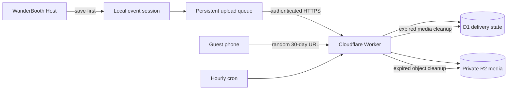

# WanderBooth Cloud QR Delivery

**Status:** Deployed and production-synthetic verified; physical-phone test pending

**Version:** 1.0.0

**Updated:** 2026-10-06

## Outcome

Every completed WanderBooth session receives one stable private link and QR code. The link opens a phone-friendly gallery containing only the branded individual photos, final layout, and looping slideshow. It works away from the booth through normal internet or mobile data, requires no customer account, and expires exactly 30 days after the session.

The cloud service is deliberately smaller than the future owner dashboard. It handles delivery only. Events, templates, raw captures, printing, and the authoritative session history remain on the booth computer.

## First-release user stories

- As a guest, I can scan one QR code and download my branded results without installing an app or giving contact details.
- As an attendant, I can see whether delivery needs setup, is queued, is uploading, is ready, failed, or expired.
- As an attendant, I can re-display a completed session's QR code and retry a failed upload from event history.
- As a booth operator, I can finish capturing, processing, and printing during an internet outage; upload resumes later without rebuilding the session.
- As the business owner, I can be confident that raw captures and print-only files are not placed in the customer cloud gallery.

## Architecture



The Host creates a 192-bit random URL-safe token when processing finishes. The token and expiry belong to the local completed-session record, so they survive restart. A background queue uploads the manifest and files idempotently, then marks the delivery ready only after every expected file exists.

## What is uploaded

Uploaded:

- each branded individual photo;
- the final branded strip or card; and
- the looping MP4 slideshow.

Never uploaded by this service:

- raw camera captures;
- the dedicated 4×6 print sheet;
- event/client names, venue notes, prices, or payment details; or
- the local session database.

## Delivery states

| State | Plain-language meaning | Operator action |
|---|---|---|
| `not_configured` | The booth has no tested Cloudflare URL/token yet | Open Cloud delivery setup and save valid credentials |
| `queued` | Local files are safe and waiting for an upload attempt | Usually none; keep internet available |
| `uploading` | The Host is sending the gallery now | Wait; capture/printing remain usable |
| `ready` | The gallery is complete and the QR is usable | Let the guest scan it or re-display it later |
| `failed` | The last attempt failed but local files remain safe | Fix internet/configuration, then retry |
| `expired` | The exact 30-day access window ended | The old link no longer serves media |

The stable QR can be displayed while queued. If it is scanned before completion, the Worker shows a branded “still preparing” page and refreshes safely. The booth UI must still label the delivery as pending until the Worker confirms readiness.

## Cloud data model and routes

D1 stores one `deliveries` row per token and one `delivery_files` row per approved file. R2 keys use `<token>/<file-id>` inside a private bucket.

Authenticated Host routes:

- `GET /api/v1/device-health`
- `PUT /api/v1/deliveries/:token`
- `PUT /api/v1/deliveries/:token/files/:fileId`
- `POST /api/v1/deliveries/:token/complete`

Guest routes:

- `GET /d/:token`
- `GET /d/:token/files/:fileId`

The Worker does not expose bucket URLs. Guest files pass through expiry and delivery-state checks. Pages use no-store, no-index, no-referrer, MIME-protection, frame-denial, and restrictive content-security headers.

## Retention

- Access ends exactly 30 days after local session completion, even if cleanup has not run yet.
- An hourly Worker cron deletes expired R2 objects and delivery-file rows.
- A minimal expired delivery row remains so the link returns a clear expired page instead of looking temporarily broken.
- An optional R2 lifecycle rule at 31 days is recommended only as a second cleanup backstop; it must not replace the Worker's exact 30-day access rule.
- Local event files are separate and remain until staff deliberately delete the event.

## Cloudflare deployment

The first deployment uses [wanderbooth-delivery.garcia-kathleenrose.workers.dev](https://wanderbooth-delivery.garcia-kathleenrose.workers.dev). Cloudflare preview URLs are disabled. A custom domain can be added later without changing the gallery design.

The following is the repeatable setup procedure used for this deployment:

1. Sign in to the correct Cloudflare account:

   ```bash
   pnpm exec wrangler login
   ```

2. Create the D1 database and copy the returned `database_id` into `cloud/wrangler.jsonc`:

   ```bash
   pnpm exec wrangler d1 create wanderbooth-delivery --config cloud/wrangler.jsonc
   ```

3. Create the private R2 bucket:

   ```bash
   pnpm exec wrangler r2 bucket create wanderbooth-delivery --config cloud/wrangler.jsonc
   ```

4. Set a new long random Host credential. Never put its value in Git, screenshots, chat logs, or documentation:

   ```bash
   pnpm exec wrangler secret put DEVICE_TOKEN --config cloud/wrangler.jsonc
   ```

5. Apply the database migration and deploy:

   ```bash
   pnpm cloud:migrate:remote
   pnpm cloud:deploy
   ```

6. In WanderBooth's operator event workspace, enter the deployed `https://...workers.dev` base URL and the same device token. **Save and test Cloudflare** validates the credentials before saving them locally.

Production resources created on 2026-10-06:

- Worker: `wanderbooth-delivery`
- D1 database: `wanderbooth-delivery` in APAC
- private R2 bucket: `wanderbooth-delivery`
- Cron Trigger: hourly at minute 17
- R2 lifecycle backstop: expire every object after 31 days
- preview URLs: disabled

The local Host stores its cloud configuration in `data/runtime/cloud-delivery.json` with owner-only file permissions. This is acceptable for the private Phase 0 booth computer; reading the credential directly from the operating-system keychain remains a later hardening step. A recovery copy of the current production token is stored in this Mac's login Keychain under service `ph.wanderpress.wanderbooth.cloudflare` and account `wanderbooth-host`; the app does not read that Keychain item automatically.

For local development, copy `cloud/.dev.vars.example` to ignored `cloud/.dev.vars`, choose a synthetic token, apply the local migration, and run `pnpm cloud:dev`. Never reuse a production token in local development.

## Operating checklist

Before an event:

1. Open the correct event and confirm Cloud delivery says **Connected**.
2. Complete one synthetic session and wait for **QR ready**.
3. Scan the QR from a physical phone using mobile data rather than the booth's local browser.
4. Open and download each individual, the layout, and the slideshow.
5. Confirm the print-only sheet and raw captures are absent.

During an event:

1. Let a ready QR be scanned before the guest leaves when possible.
2. If delivery is queued, reassure the guest that the same link will become ready after connectivity returns.
3. Use event history to retry failures and re-display the QR.
4. Never delete the local event while a session is queued or failed.

After an event:

1. Review session history for queued, uploading, or failed deliveries.
2. Keep a deliberate local backup according to the business policy.
3. Confirm expiry behavior and cleanup from Cloudflare logs/metrics during the pilot.

## Acceptance criteria

- A completed synthetic session reaches `ready` through the real deployed Worker. **Passed on 2026-10-06.**
- A current iPhone or Android phone opens the gallery over mobile data.
- Every expected branded individual, layout, and slideshow opens and downloads.
- No raw capture, print sheet, event/client metadata, or secret appears in cloud storage or the public repository.
- Disconnecting internet does not stop capture, local processing, print preview, or native printing.
- Restarting the Host restores an interrupted upload to the queue.
- Repeating a manifest, file, or completion request does not create duplicate guest files.
- A gallery refuses access at its exact expiry time, and scheduled cleanup deletes its R2 objects.
- Invalid Host credentials cannot create or modify a delivery. **Deployed health check returns HTTP 401 for an invalid token.**

## Pilot measurements

- percentage of completed sessions reaching `ready` before the guest leaves;
- median time from local completion to QR readiness;
- failed deliveries requiring manual retry;
- successful phone opens/downloads by iOS and Android;
- bytes stored and served per event; and
- expired deliveries whose R2 objects were removed by the next hourly cleanup.

## Deferred work

- custom domain;
- operator revocation button and per-device credential rotation;
- Cloudflare rate limiting and production alerting;
- OS-keychain credential storage;
- resumable/chunked uploads for substantially larger media;
- full owner dashboard, sales reporting, remote settings, and broader cloud backup; and
- AR effects or managed filter APIs.
